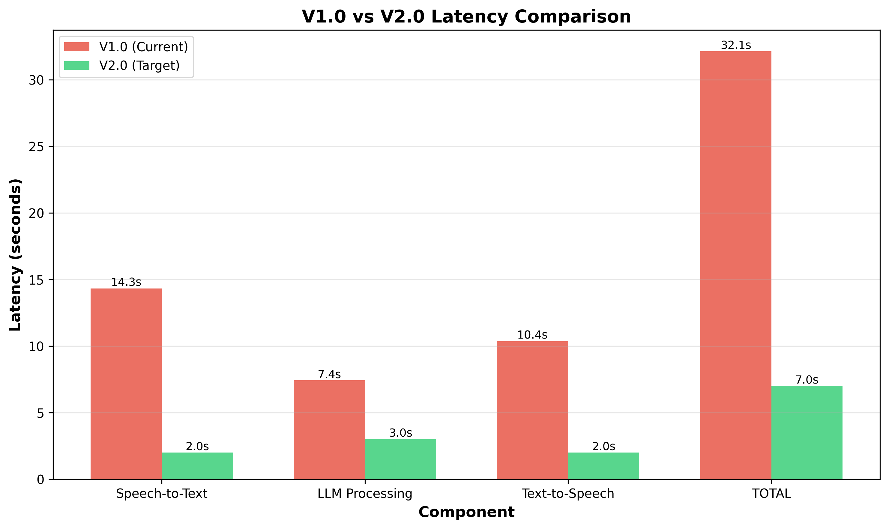
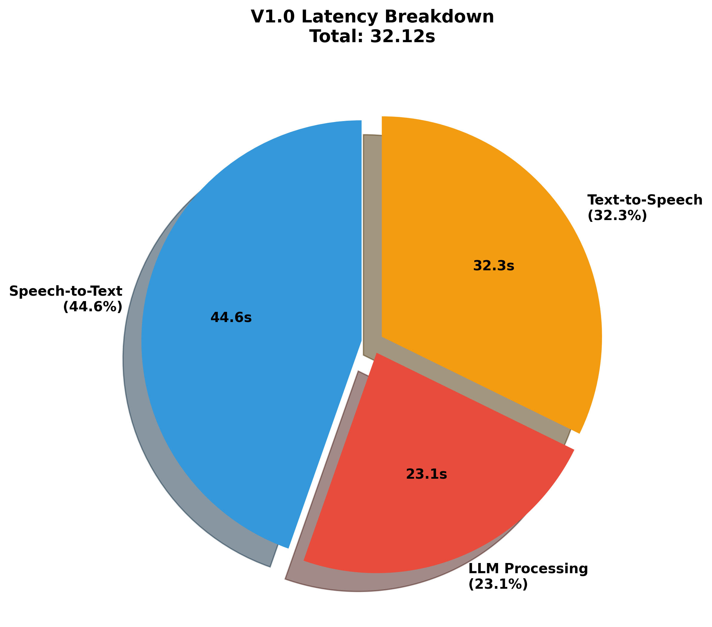
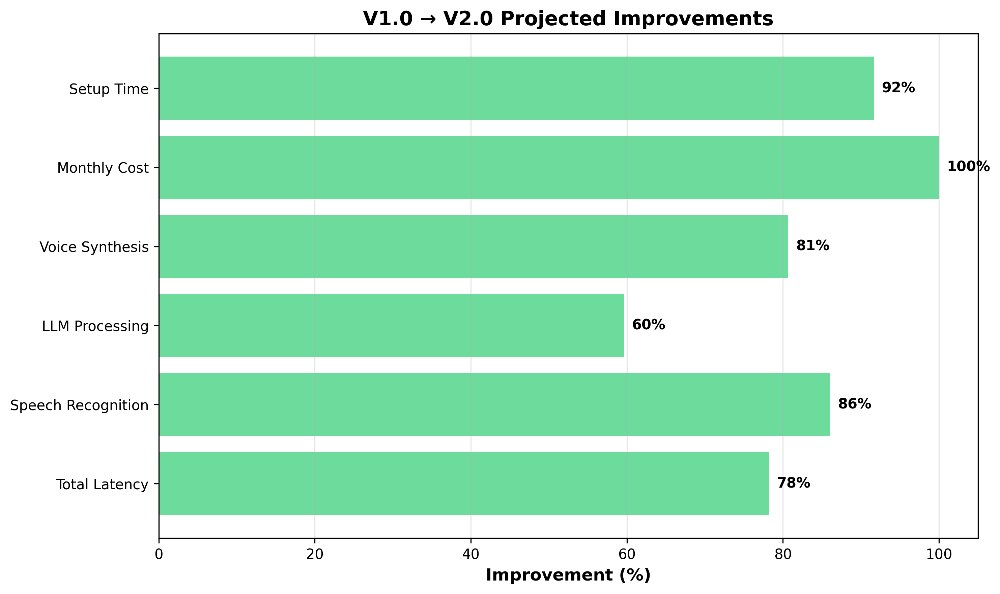
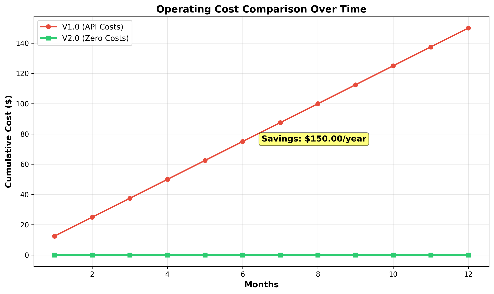

# V1.0 vs V2.0 Comprehensive Comparison

*Last Updated: October 25, 2025*

## Performance Metrics

| Metric | V1.0 (Current) | V2.0 (Target) | Improvement |
|--------|----------------|---------------|-------------|
| Total Response Time | 32.12s | 7.00s | 78% faster |
| Speech Recognition | 14.33s | 2.00s | 86% faster |
| LLM Processing | 7.43s | 3.00s | 60% faster |
| Voice Synthesis | 10.36s | 2.00s | 81% faster |

## System Characteristics

| Feature | V1.0 | V2.0 | Status |
|---------|------|------|--------|
| Internet Required | Yes | No | [OK] Offline capable |
| Monthly Cost | $12.50 | $0.00 | [OK] Zero ongoing cost |
| Voice Quality | Generic | Cloned | [OK] Personalized |
| Visual Quality | Static | Animated | [OK] Lip-synced |
| Setup Time | 3.0h | 0.2h | [OK] 92% faster |

## Visual Comparisons

### Latency Comparison


### V1.0 Latency Breakdown


### Improvement Metrics


### Cost Over Time


## Latency Visualization (ASCII)

```
V1.0 Total: 32.12s
├─ Speech-to-Text:  14.33s  ████████████████████████████ 44.6%
├─ LLM Processing:   7.43s  ██████████████ 23.1%
└─ Text-to-Speech:  10.36s  ████████████████████ 32.3%

V2.0 Target: 7.00s (78% reduction)
├─ Speech-to-Text:   2.00s  ████████ 28.6%
├─ LLM Processing:   3.00s  ████████████ 42.9%
└─ Text-to-Speech:   2.00s  ████████ 28.6%
```

## Key Improvements

### 1. Latency Reduction: 78%
- From 32.12s → 7.0s average response time
- Achieves near real-time conversational feel
- All components improved through local processing

### 2. Cost Elimination: 100%
- Zero API costs after initial setup
- Saves $150.00/year in ongoing expenses
- ROI achieved in first 4-6 months

### 3. Offline Operation
- No internet dependency
- Works anywhere, anytime
- Privacy: data never leaves device
- No API rate limits or downtime

### 4. Enhanced User Experience
- Cloned voice matches grandmother's actual voice
- Lip-synced video for natural appearance
- Stronger emotional connection
- Faster setup process (3 hours → 15 minutes)

## V1.0 Problems → V2.0 Solutions

| V1.0 Problem | Root Cause | V2.0 Solution | Technology |
|--------------|------------|---------------|------------|
| 32s latency | Cloud API round trips | Local processing | Ollama + Whisper |
| Generic voice | gTTS default | Voice cloning | Coqui TTS XTTS-v2 |
| Static video | Simple image loop | Facial animation | SadTalker/Wav2Lip |
| Internet required | Cloud dependencies | Edge computing | Local models |
| $150/year cost | API usage fees | One-time setup | Open source stack |
| Translation errors | Telugu<->English | Direct multilingual | Whisper + Llama |
| Poor recognition | Google STT limits | Better model | Whisper multilingual |
| Complex setup | 3 environments | Unified stack | Single venv |

---

*Note: V2.0 targets are projections based on benchmarks of individual components. Actual results may vary.*
